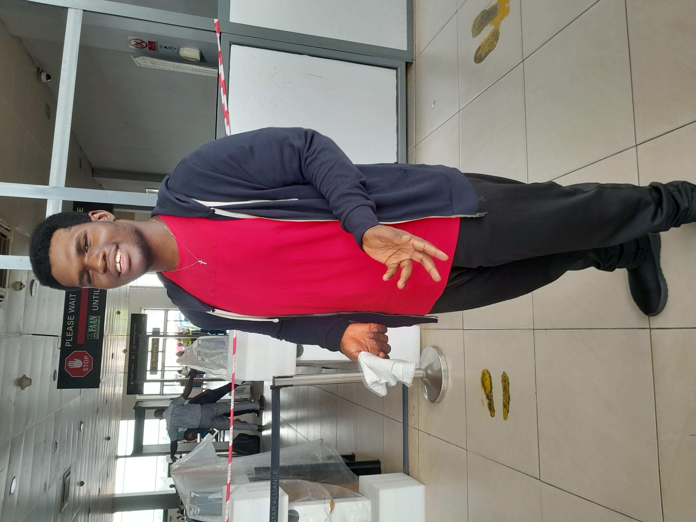

# HW1
This repository was built for homework 1 in Multimedia Authoring 1.
# Hey This is Ajay 🤩& Jack 😎
## **Ajay Chakaravarthy Antony Raj**
**This is the Picture of Myself (23 years ago)**

##  Three Random Facts about Me 🤔
1. I love pets and I have a dachshund named “Tinu” and a Indian green parrot named “Jack” (Yes,the same as my teammate's name)
2. I am a foodie and I really love to eat foods from different types of cuisine.
3. I consider myself a Weeb and I really love Anime and Japanese culture. 

## Favorite Food 😋
- Biryani
- Parota
- Sea food (Meen Kuzhambu)

## **Tamunotubo Princeton Jackreece**

**A picture of myself Jack**

##  Three Random Facts about Me 🤔
1. I love gaming
2. I love talking about tech
3. I love Anime and Japanese culture. 

## Favorite Food 😋
- Pizza
- Spaghetti
- Sandwich

## Installation
No Installition Required
## Usage
It depends on waking up time
## Contributing
1. Confirm that you want to use this template; if so, fork it!

2. Depending on your wake-up time, copy the repository to your computer by cloning it

3. Make any necessary adjustments or modifications

4. Submit your changes and initiate a pull request on GitHub

5. Enjoy! 🎉

## Credits
*Ajay* 

*Jack*
## License
See License File

